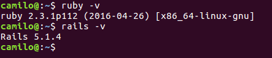
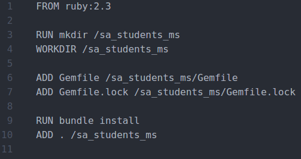
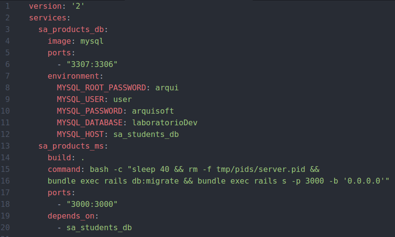
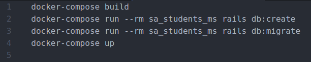
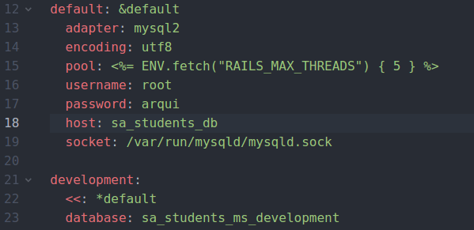

<p align="center">
  
  <br>
</p>

<p align="center">
  <b>Jeisson Andrés Vergara Vargas, M.Sc. (c)</b>
  <br>
  <b>Software Architecture</b>
  <br>
  <b>2018-I</b>
</p>
<br><br>

### Creación de Microservicio con Ruby on Rails (RoR)

**1.** Instalar Ruby y RoR según el
sistema operativo:


http://rubyonrails.org.es/instala.html


**2.** Realizar el proceso de instalación, y verificar que se encuentren correctamente instalados usando los siguientes comandos:

>```ruby -v```

>```rails -v```


### Creación de Máquinas Virtuales

**3.** Dirigirse a la carpeta donde se creará el microservicio e ingresar el comando:

> `rails new sa_students_ms -d mysql --api`


**4.** En la raíz del proyecto creado, ejecutar:

> `gem install mysql2`

**5.** Agregar las siguientes líneas en el Gemfile:

> `gem 'therubyracer', :platforms => :ruby`

> `gem 'execjs'`

**6.** Con el fin de instalar las gemas del proyecto, ejecutar el siguiente comando en la raíz del proyecto:

> `bundle install`

### Dockerización del Microservicio

**7.** Crear tres archivos en la raíz del proyecto:

* [Dockerfile](./files/Dockerfile)



* [docker-compose.yml](./files/docker-compose.yml)



* [start.sh](./files/start.sh)



**8.** 31. Configurar el archivo **/config/database.yml**, poniendo el usuario y contraseña correspondientes, declarados en el archivo docker-compose.yml (en default: username, password; en development: database). Así mismo, agregar el host en default.



**9.** Ejecutar el archivo **./start.sh** para desplegar el microservicio
