

  

<h2 align="center"><small>Workshop #1</small>  <big>Infrastructure</big></h2>

<h5 align="center">Jeisson Andrés Vergara Vargas <small>Software Architecture 2018-I</small></h5>

---

# Caso de Estudio:
El caso de estudio que se trabajará en la materia es sobre un Sistema de Información Académico (SIA), se establecieron inicialmente los siguientes microservicios y lenguajes de programación:
- Estudiantes (Ruby).
- Materias (Java).
- Notas por Materia (Ruby).

## Requisitos Iniciales

### Ruby on Rails (RoR)

  **a.** Instalar Ruby y RoR según el sistema operativo:

http://rubyonrails.org.es/instala.html

  **b.** Realizar el proceso de instalación, y verificar que se encuentren correctamente instalados usando los siguientes comandos:

> `ruby -v`

> `rails -v`

  

### Java

  **a.** Instalar Java JRE 1.8.0.25.

http://www.oracle.com/technetwork/java/javase/downloads/java-archive-javase8-2177648.html

  **b.** Verificar la versión instalada

>`java -version`

   

  **c.** Descargar el conector de mysql para java la version 5.1.34

https://downloads.mysql.com/archives/c-j/

### Aplicaciones
  **a.** Postman:

https://www.getpostman.com/

  **b.** Mysql Workbench:

https://www.mysql.com/products/workbench/

  **c.** Maven:

https://maven.apache.org/install.html

## Creación de los Microservicios

### **a.** Microservicio "Students" en Ruby On Rails

**1.** Dirigirse a la carpeta donde se creará el microservicio e ingresar el comando:

> `rails new sa_students_ms -d mysql --api`

**2.** En la raíz del proyecto creado, ejecutar:

> `gem install mysql2`

**3.** Agregar las siguientes líneas en el Gemfile:

> `gem 'therubyracer', :platforms => :ruby`

> `gem 'execjs'`

**4.** Con el fin de instalar las gemas del proyecto, ejecutar el siguiente comando en la raíz del proyecto:

> `bundle install`

### Dockerización del Microservicio

**5.** Crear dos archivos en la raíz del proyecto:

* [Dockerfile](./files/Dockerfile)

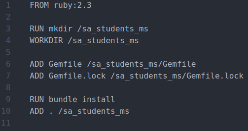

* [docker-compose.yml](./files/docker-compose.yml)

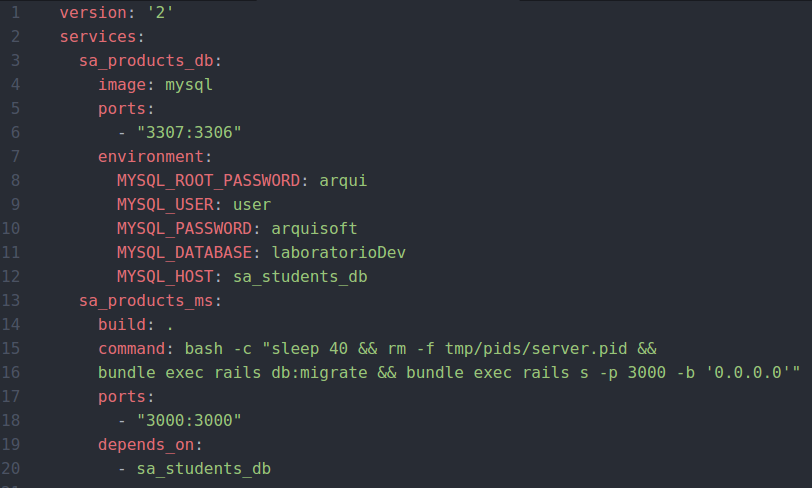

**6.** Configurar el archivo **/config/database.yml**, poniendo el usuario y contraseña correspondientes, declarados en el archivo docker-compose.yml (en default: username, password; en development: database). Así mismo, agregar el host en default.

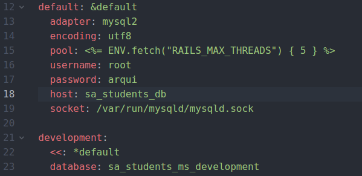

**7.** Ejecutar los siguientes comandos para desplegar el microservicio

>	`docker-compose build  
         docker-compose run --rm sa_apigateway_ms rails db:create  
         docker-compose run --rm sa_apigateway_ms rails db:migrate  
         docker-compose up `

**8.** Verificar el Servidor Rancher, allí se podrán visualizar los dos contenedores creados: uno para la base de datos y otro para el microservicio:

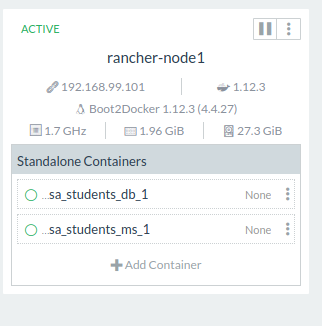

**9.** Verificar la dirección http://192.168.99.101:3000:

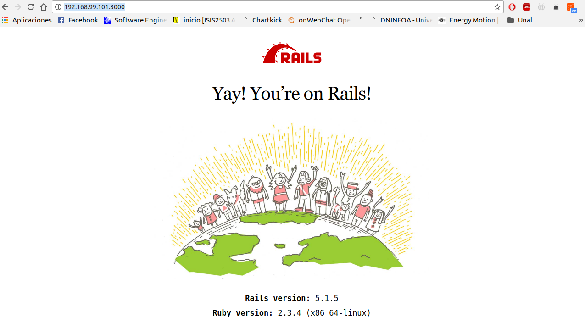

### Creación del API-REST del Microservicio

**10.** Realizar Ctrl + C en la consola para salir.

**11.** El microservicio creado se encargará de los estudiantes, por lo tanto tendrá un modelo llamado Student, que tendrá los siguientes atributos:

* id: Integer
* name: String
* lastname: String
* email: String
* code: Integer
* telephone: Bigint

**12.** Para generar el model, ejecutar el siguiente comando:

>	` rails generate scaffold Student name:string lastname:string email:string code:integer telephone:bigint `

**13.** Se crearán los controladores necesarios para realizar las operaciones CRUD del modelo Student.

**14.** Desplegar nuevamente el microservicio ejecutando ./start.sh.

### Comprobación del API-REST

**15.** Operación Create Student. En Postman:

http://192.168.99.101:3000/products:

**Body:**  
> {  
	"name": "Camilo",  
  "lastname": "Dajer",  
  "email": "cadajerp@unal.edu.co",  
	"code": 28791234,  
	"telephone": 123456789  
}

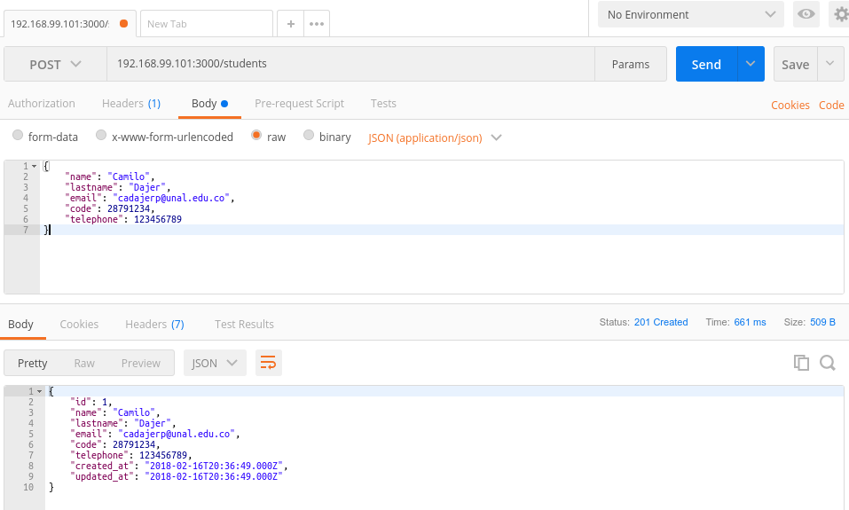

**16.** Operación Get All Products. En Postman:   http://192.168.99.101:3000/students:

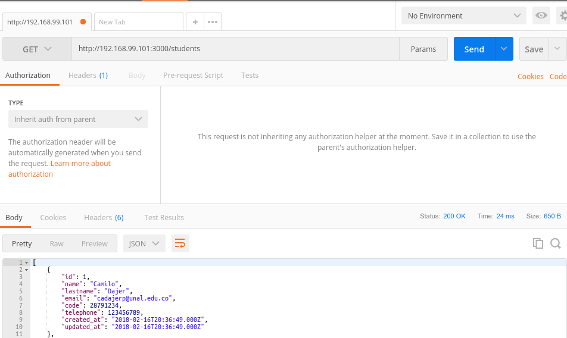

**17.** Operación Get Student By Id. En Postman: http://192.168.99.101:3000/students/1 (para id: 1):

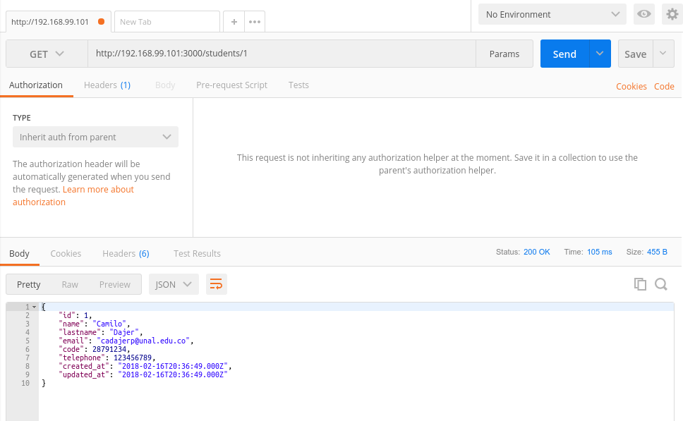

### **b.** Microservicio "Courses" en Java
**18.** Crear la estructura para el microservicio

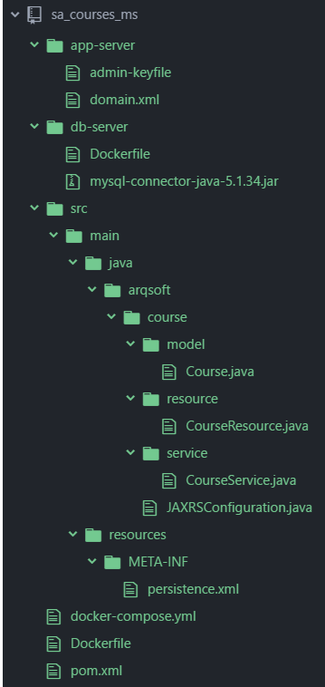

**19.** En java se utilizará un modelo por capas y el vínculo del código se puede descargar del siguiente vínculo y como servidor de aplicaciones se utilizará Glassfish.

**20.** Ahora se explicará los archivos que involucran explícitamente con Docker.

**a.** ./db-server/Dockerfile: En este archivo indicaremos la imagen a utilizar para nuestro motor de base de datos que en este caso es "MySQL", además con la sentencia "ENV" estaremos configurando las variables de entorno para esa imagen.

    From mysql

    ENV MYSQL_ROOT_PASSWORD 123
    ENV MYSQL_DATABASE courses
    ENV MYSQL_USER arqsoft
    ENV MYSQL_PASSWORD 123

**b.** ./Dockerfile: En este archivo indicaremos la imagen del servidor de aplicaciones que ejecutará nuestro código hecho en Java, para este caso utilizaremos el servidor de "Glassfish" y los comandos siguientes se encargarán de proporcionar todos los archivos necesarios para que el servidor de aplicaciones ejecute nuestra aplicación, por ejemplo: el conector de java con mysql, los archivos del dominio y la llave de acceso proporcionada en la carpeta de "app-server" y el archivo war que se genera al compirar el código.

    FROM glassfish

    COPY db-server/mysql-connector-java-5.1.34.jar glassfish/lib/mysql-connector-java-5.1.34.jar
    COPY app-server/domain.xml glassfish/domains/domain1/config/domain.xml
    COPY app-server/admin-keyfile glassfish/domains/domain1/config/admin-keyfile
    COPY target/courses.war glassfish/domains/domain1/autodeploy/courses.war

**c.** ./docker-compose.yml: En este archivo indicamos la información adicional para la creación de los contenedores como por ejemplo: de donde tomar los archivos Dockerfile para las imágenes, los puertos de exposición, vínculos, entre otros.

    courses-db:
      build: ./db-server
      ports:
        - "3309:3306"
    courses-ms:
      build: .
      ports:
        - "4040:4040"
      links:
        - courses-db

**21.** Ya teniendo todos los archivos preparados ejecutamos el siguiente comando para la verificación y creación del archivo de ejecución war.

>mvn -f pom.xml package

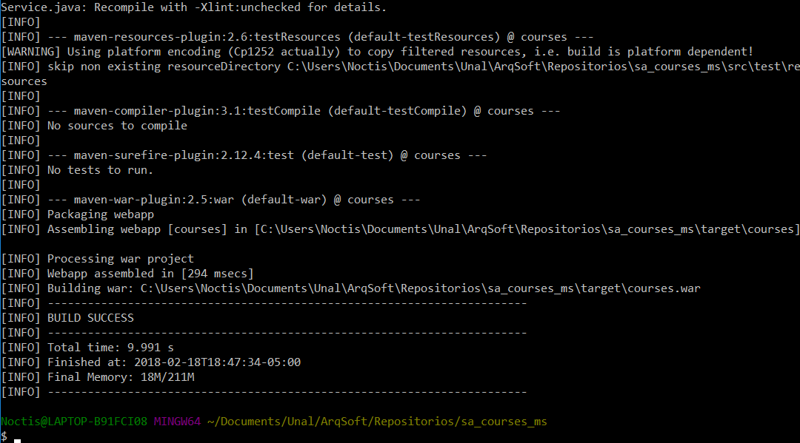

Verificamos que haya finalizado correctamente, en caso de no haber sido así verificar y corregir los errores que nos mostrará en consola.

**22.** Tener encuenta que debemos tener seleccionado el nodo al cual desplegaremos los contenedores.

**22.** Ahora ejecutaremos el comando "docker-compose build", el cual docker compose es una herramienta de orquestación para Docker que le permite definir un conjunto de contenedores y sus interdependencias en forma de un archivo YAML (yml). En este caso ubicará las imágenes según se haya especificado en los archivos Dockerfile y realizará las configuraciones establecidas en estos. Una vez finalizado verificamos que no hayan errores.

>docker-compose build

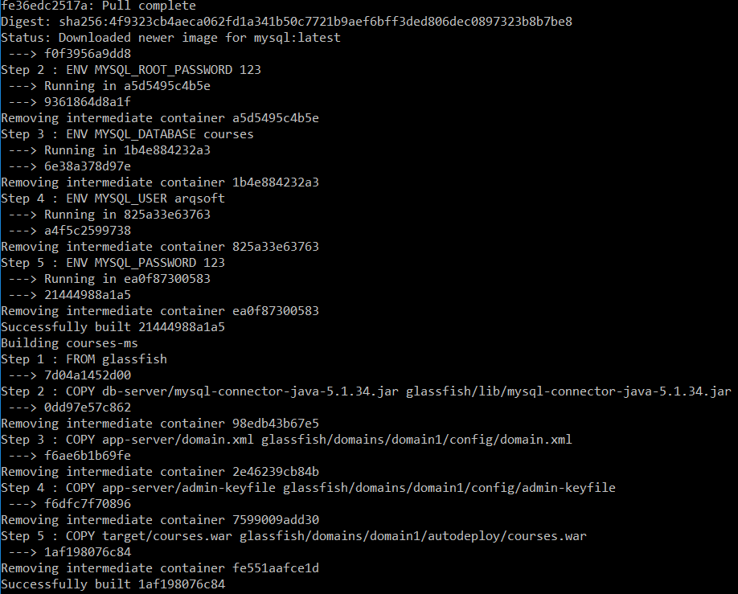

**23.** Como paso final ejecutaremos el comando "docker-compose up" para que nos cree los contenedores en el nodo seleccionado

>docker-compose up

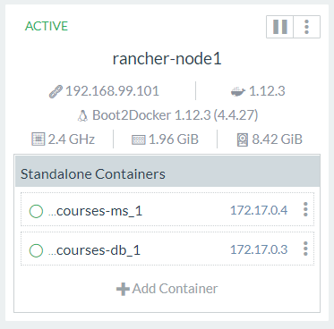

**24.** Utilizaremos la herramienta "Postman" como en el caso del contenedor de estudiantes para verificar que las operaciones CRUD estén funcionando y con la herramienta de MySQL Workbench para ver la base de datos. La dirección para las peticiones es: http://192.168.99.101:4040/courses/resources/course

    {
        "name": "Software Architecture",
        "credits": 3
    }

